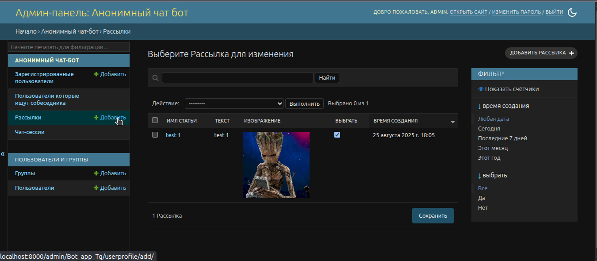
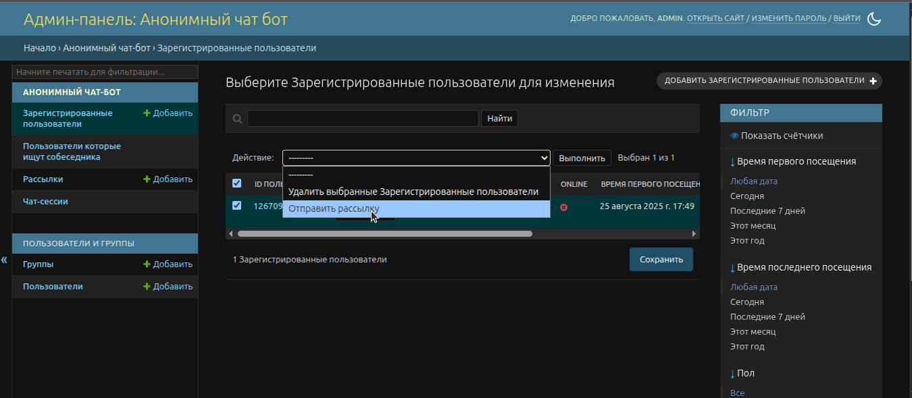

# 📢 Руководство по рассылке через админ-панель

## 🎯 Что такое рассылка?

Рассылка позволяет отправлять сообщения всем пользователям вашего бота одновременно либо выбранным пользователям. Это полезно для:
- Уведомлений о новых функциях
- Промо-акций
- Важных объявлений
- Технических работ

**⚠️ Важно:** Рассылки создаются заранее и сохраняются в системе. Вы можете создать несколько рассылок и отправлять их по мере необходимости.

## 📱 Подготовка к рассылке

### 1. Убедитесь, что все сервисы запущены:
```bash
# Redis (обязательно!)
sudo systemctl status redis-server

# Celery Worker
ps aux | grep "celery.*worker"

# Django сервер
ps aux | grep "manage.py runserver"
```

### 2. Войдите в админ-панель:
- Откройте: http://localhost:8000/admin/
- Войдите с вашими учетными данными

## 🔍 Пошаговая инструкция по рассылке

### Шаг 1: Создание рассылки
1. В админ-панели найдите раздел **"АНОНИМНЫЙ ЧАТ-БОТ"**
2. Нажмите на **"Рассылки"** в левом меню
3. Нажмите кнопку **"ДОБАВИТЬ РАССЫЛКА +"**

### Шаг 2: Заполнение формы рассылки
1. **ИМЯ СТАТЬИ:** Введите название рассылки (например: "Новости")
2. **ТЕКСТ:** Введите текст сообщения для рассылки
3. **ИЗОБРАЖЕНИЕ:** Загрузите изображение (опционально)
4. Нажмите **"Сохранить"**

### Шаг 3: Отправка рассылки пользователям
1. Перейдите в раздел **"Зарегистрированные пользователи"**
2. Поставьте галочки на нужных пользователях, которым хотите отправить рассылку
3. В выпадающем списке **"Действие:"** выберите **"Отправить рассылку"**
4. Нажмите кнопку **"Выполнить"**
5. Дождитесь подтверждения

## 📸 Скриншоты процесса

### Скриншот 1: Создание новой рассылки


### Скриншот 2: Отправка рассылки


## ⚠️ Важные замечания

### Безопасность:
- **Проверяйте текст** перед отправкой
- **Не спамьте** пользователей
- **Соблюдайте правила** Telegram

### Технические требования:
- **Redis должен быть запущен**
- **Celery Worker должен работать**
- **Бот должен быть активен**

### Ограничения:
- **Размер фото:** до 10 МБ
- **Длина текста:** до 4096 символов
- **Частота рассылок:** не чаще 1 раза в день

## 🚨 Решение проблем

### Рассылка не отправляется:
1. **Проверьте Redis:** `redis-cli ping`
2. **Проверьте Celery:** `ps aux | grep celery`
3. **Проверьте логи Django**
4. **Убедитесь, что бот работает**

### Ошибка "Connection refused":
- Redis не запущен
- Запустите: `sudo systemctl start redis-server`

### Ошибка "Celery not responding":
- Celery Worker не запущен
- Запустите: `celery -A project_Tg worker --loglevel=info`

### Логи Celery:
```bash
# Просмотр логов в реальном времени
tail -f celery.log

# Поиск ошибок
grep "ERROR" celery.log
```
